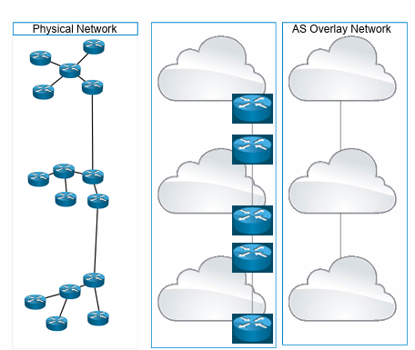
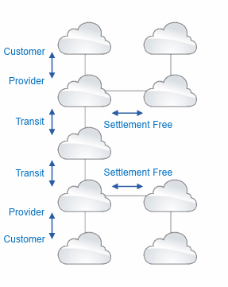
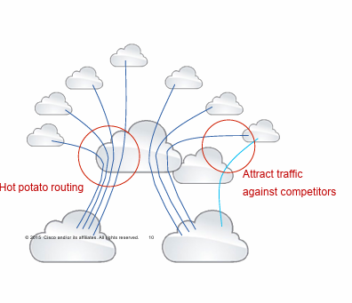
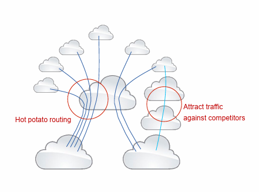
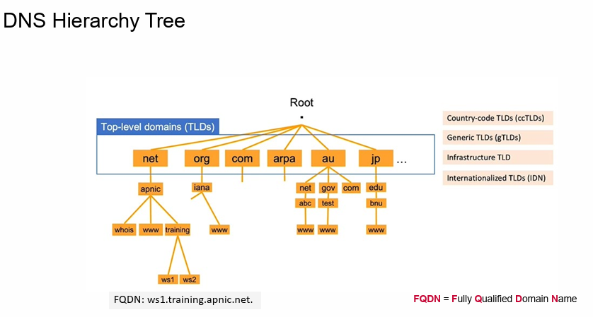
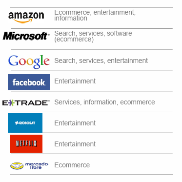
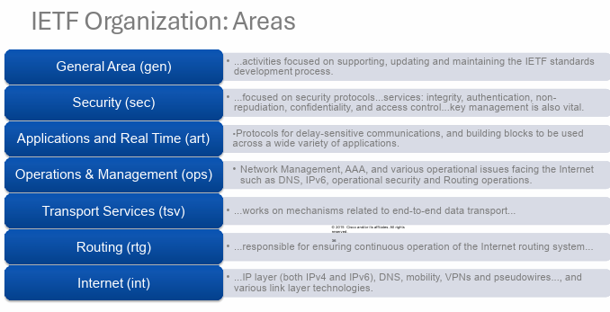

  <h1>Tugas 4 </h1>
 <h2>  Workshop Administrasi Jaringan</h2>
<strong>DEBIAN</strong>

  

Oleh:

<li>Denti Widayati (3122500003)</li>
<li>Virginia Faiqoh (3122500022 )</li>

 

  Dosen Pembimbing     :  Dr. Ferry Astika Saputra ST, M.Sc

 
PROGRAM STUDI D3 TEKNIK INFORMATIKA
POLITEKNIK ELEKTRONIKA NEGERI 
SURABAYA
2023 / 2024

      

  <h3>1. Baca tentang Ekosistem Internet (Materi sudah diunggah di Ethol). Tuliskan pendapatmu tentang bagaimana Internet bekerja (tugas pribadi)!</h3>

  
Jawaban :
  
  Internet adalah jaringan komputer global yang menghubungkan miliaran perangkat di seluruh dunia.
  Cara kerjanya mirip dengan sistem pos, di mana data dipecah menjadi paket-paket kecil, dikirim melalui jaringan berbeda dan kemudian disusun kembali di tujuan. Berikut  beberapa poin penting tentang cara kerja Internet: 
  
  1. Koneksi perangkat:  
  - Perangkat seperti komputer, ponsel cerdas, dan tablet terhubung ke Internet melalui berbagai media, seperti kabel, Wi-Fi, atau seluler jaringan. AS Overlay Network adalah jaringan virtual yang beroperasi di atas Physical Network. Physical Network memiliki batasan geografis dan kapasitas bandwidth, sedangkan AS Overlay Network tidak  

    

  -  Setiap perangkat memiliki alamat IP unik yang berfungsi sebagai pengenal di Internet. Cloud computing merupakan teknologi yang memungkinkan pengguna untuk mengakses layanan komputasi, penyimpanan, dan jaringan melalui internet.  
  
     
 
  2. Kirim data:  
  - Saat memasukkan alamat situs web ke browser, komputer  mengirimkan permintaan ke server situs web tersebut. Permintaan ini dibagi menjadi paket data kecil  yang disebut datagram. Datagram ini kemudian dirutekan melalui Internet ke server web. Hot potato routing adalah teknik perutean data di jaringan internet di mana setiap node (simpul) dalam jaringan berusaha untuk meneruskan paket data ke tetangga terdekatnya secepat mungkin, tanpa memprioritaskan pemilihan jalur optimal menuju tujuan akhir. 

  
     
  
  3. Protokol dan Jaringan:  
  - Internet menggunakan berbagai protokol untuk mengatur transmisi data, seperti TCP/IP. Datagram dirutekan melalui jaringan ini berdasarkan alamat IP tujuan. Sistem Penamaan Domain (DNS) memiliki struktur hierarkis terdesentralisasi, yang  artinya  dibagi menjadi beberapa level yang berbeda.  Setiap level  memiliki tanggung jawab tertentu dalam  menerjemahkan nama domain menjadi alamat IP. 
      - .com - Organisasi komersial  
      - .org - Organisasi nirlaba  
      - .net - Jaringan  
      - .edu - Institusi pendidikan  
      - .gov - Pemerintah  
  
     
  
  4. Server dan Layanan:  
  - Server adalah komputer yang menyimpan data dan menyediakan layanan Internet seperti situs web, email, dan streaming video. Saat mengakses layanan Internet, komputer Anda akan terhubung ke server yang menyediakan layanan tersebut. Server kemudian akan mengirimkan data yang diminta ke komputer. Berikut adalah beberapa server dan layanan internet yang tersedia:  

     
 
  5. Keamanan dan privasi:  
    - Internet memiliki berbagai mekanisme keamanan untuk melindungi data dan privasi pengguna, seperti enkripsi dan firewall. Pengguna juga harus mengambil langkah-langkah untuk melindungi diri mereka secara online, seperti menggunakan kata sandi yang kuat dan waspada terhadap phishing. IETF adalah badan standar internasional yang bertanggung jawab untuk mengembangkan dan memelihara standar internet. IETF memiliki beberapa kelompok kerja yang berfokus pada keamanan dan privasi.  
    
    

  Jadi kesimpulannya adalah Internet bekerja dengan menghubungkan berbagai perangkat di seluruh dunia melalui jaringan komputer. Perangkat tersebut dapat berupa komputer, smartphone, tablet, router, dan lainnya.

  Data yang ditransmisikan melalui internet dipecah menjadi paket-paket kecil dan dialihkan melalui jaringan router dan switch. Router dan switch ini menentukan jalur terbaik untuk paket data mencapai tujuannya.

  Ketika paket data mencapai tujuannya, mereka dirakit kembali menjadi data asli dan ditampilkan kepada pengguna.
  

  

  

