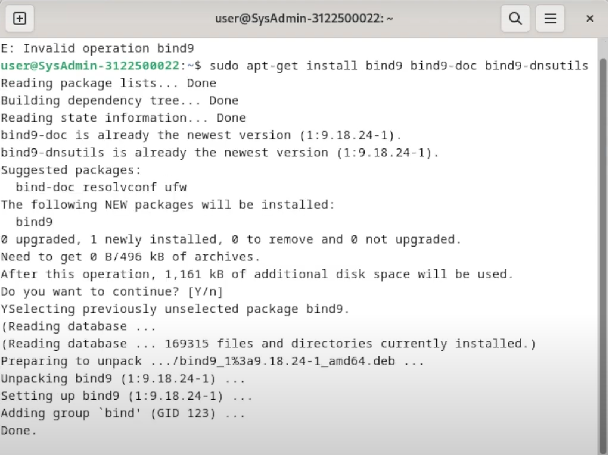
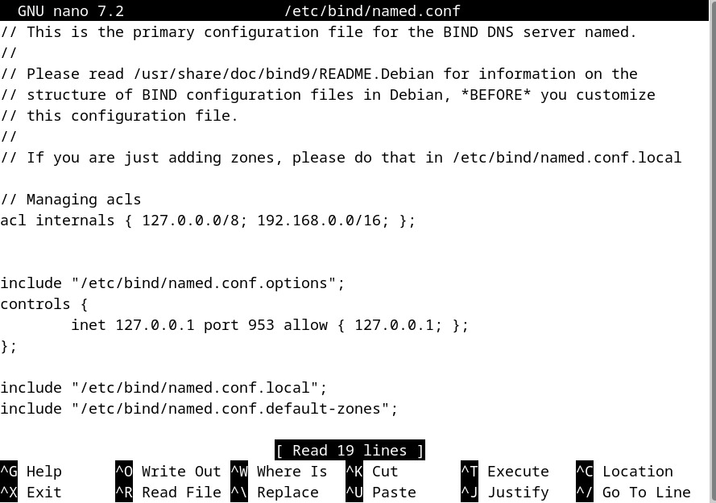
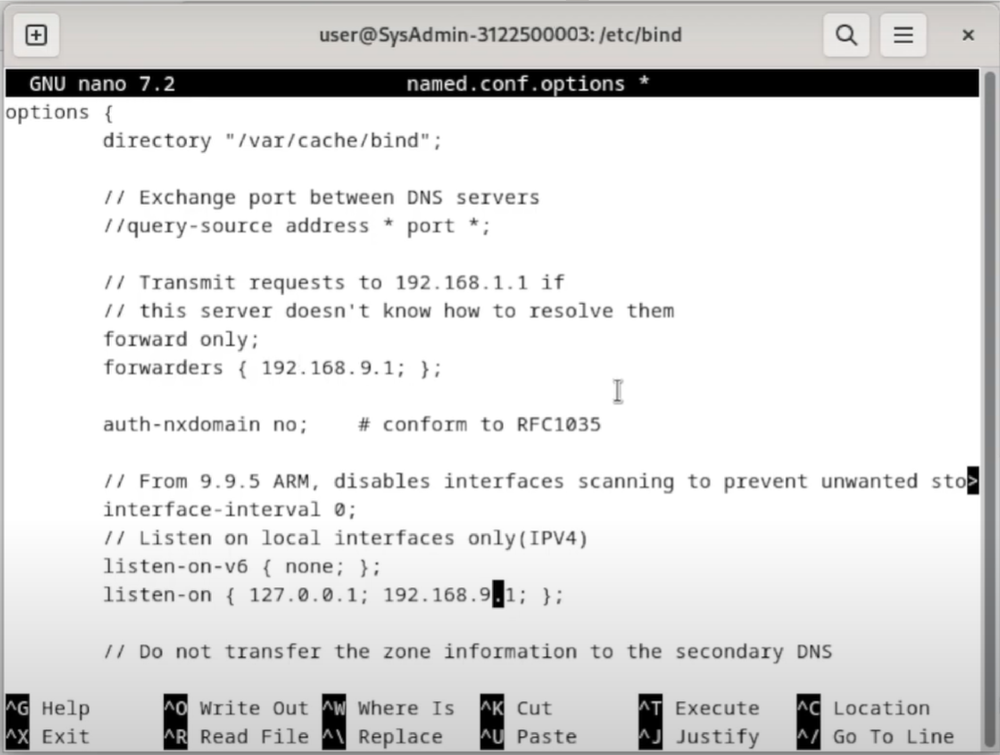
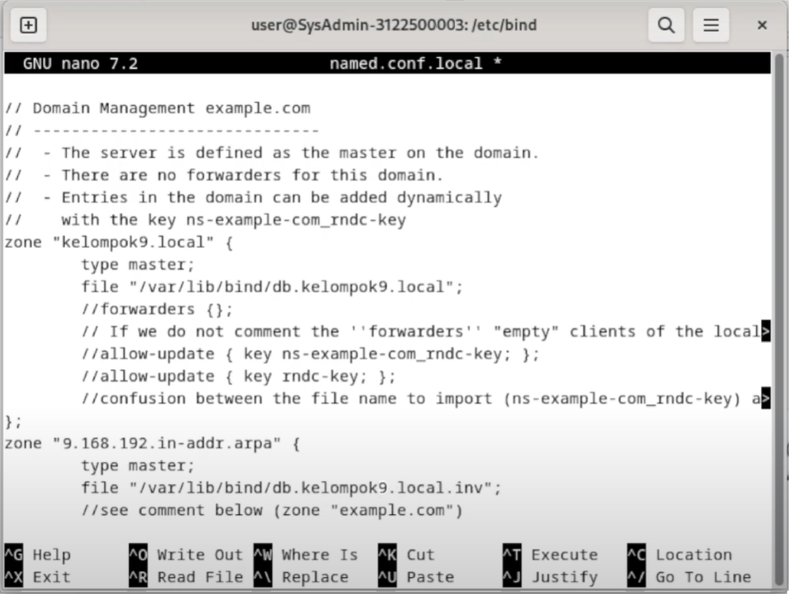
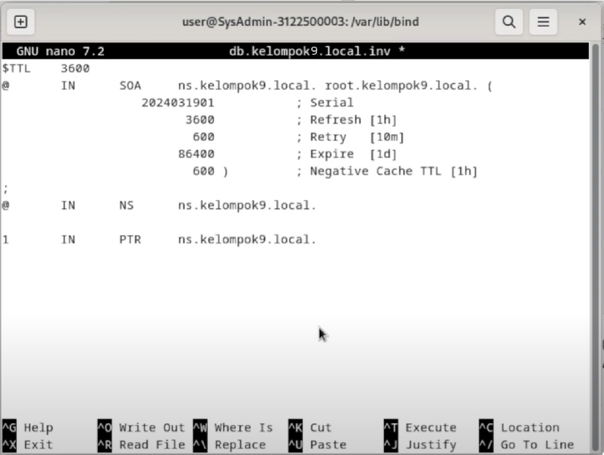
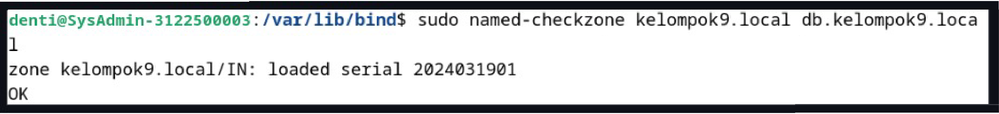
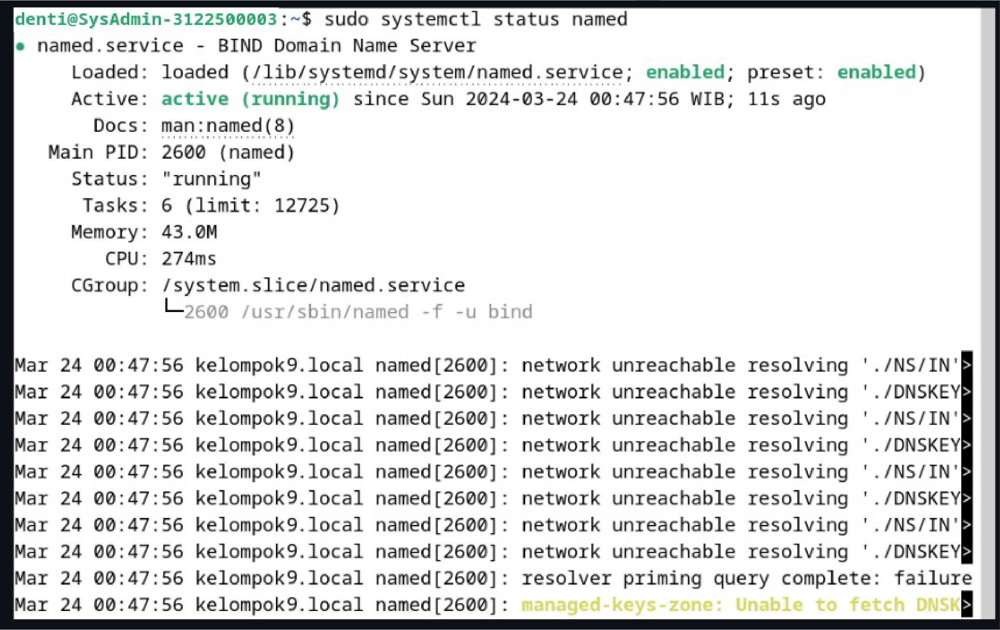
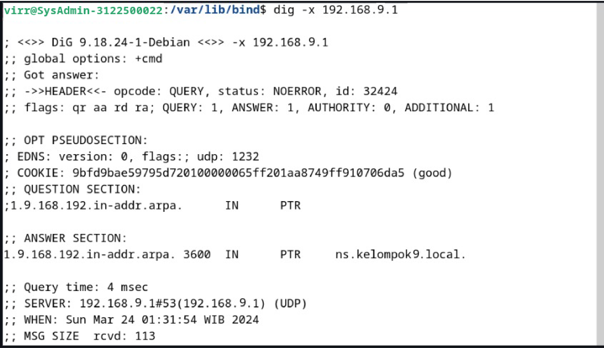
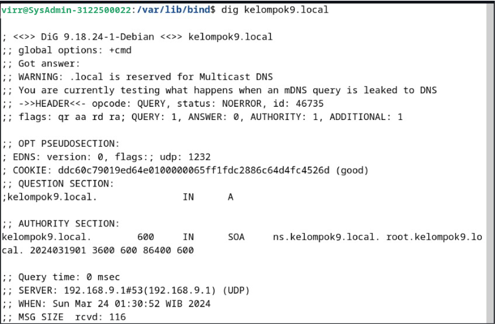

  <h1>Tugas 4 </h1>
 <h2>  Workshop Administrasi Jaringan</h2>
<strong>Konfigurasi Bind9 </strong>

  

Oleh:

<li>Denti Widayati (3122500003)</li>
<li>Virginia Faiqoh (3122500022 )</li>

 

  Dosen Pembimbing     :  Dr. Ferry Astika Saputra ST, M.Sc

 
PROGRAM STUDI D3 TEKNIK INFORMATIKA
POLITEKNIK ELEKTRONIKA NEGERI 
SURABAYA
2023 / 2024

      

<h2>langkah-langkah untuk instalasi DNS sever menggunakan BIND9 pada Debian 12:</h2>

<h3>1. Install BIND 9</h3>

menggunakan perintah : 
<b>sudo apt install bind9 bind9-doc</b>

<h3>2. Buka file named.conf</h3>

menggunakan perintah : 
<b>sudo nano /etc/bind/named.conf</b>

<h3>3. Edit file named.conf</h3>

<h3>4. . Buka file named.conf.options</h3>

<h3>5. Edit file named.conf.options</h3>

<h3>6. Buka file named.conf.local</h3>

mengguakan perintah:
 
<b>sudo nano /etc/bind/named.conf.options</b>

<h3>7. Edit file named.conf.local</h3>

<h3>8. Memeriksa kesalahan sintaks file named.conf</h3>

menggunkan perintah 

<b>sudo named-checkconf /etc/bind/named.conf</b>

<h3>9. Buka file db.kelompok9.local</h3>

menggunakan perintah : 

<b>sudo nano /var/lib/bind/db.kelompok9.local</b>

<h3>10. Edit file db.kelompok9.locall</h3>

menggunakan perintah : 

<h3>11. Buka file db.kelompok9.local.inv</h3>

menggunakan perintah

<b>sudo nano /var/lib/bind/db.kelompok9.local.inv</b>

<h3>12. Edit file db.kelompok9.local.invl</h3>

<h3>13. Memeriksa kesalahan sintaks file db.kelompok3.loca</h3>

menggunakan perintah : 
<b>sudo named-checkzone kelompok9.local db.kelompok9.local</b>

<h3>14. Buka file resolv.conf</h3>

menggunakan perintah : 
<b>sudo nano /etc/resolv.conf</b>

<h3>15. Edit file resolv.conf</h3>

 

<h3>16. Merestart BIND DNS</h3>

menggunakan perintah : 
<b>sudo systemctl restart named</b>

<h3>17. Memeriksa status BIND DNS</h3>

menggunakan perintah : 
<b>sudo systemctl status named</b>

<h3>18. Melakukan query DNS domain kelompok9.local</h3>

menggunakan perintah : 
<b>dig kelompok9.locald</b>

<h3>19. Melakukan reverse DNS lookup alamat IP 192.168.9.1</h3>

menggunakan perintah : 
<b>dig -x 192.168.9.1</b>

<h3>20. Mencari server DNS domain</h3>

menggunakan perintah : 
<b>nslookup ns</b>

