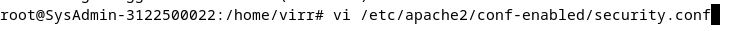
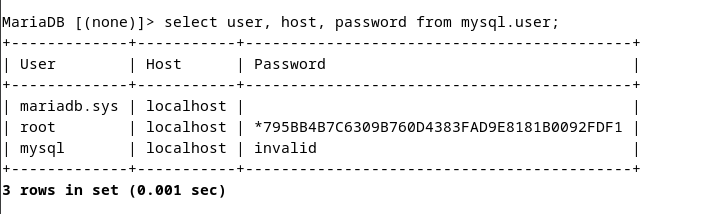
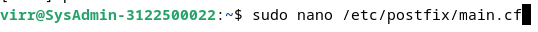

  <h1>Tugas 5 </h1>
 <h2>  Workshop Administrasi Jaringan</h2>
<strong>DEBIAN</strong>

  

Oleh:

<li>Virginia Faiqoh (3122500022 )</li>

 

  Dosen Pembimbing     :  Dr. Ferry Astika Saputra ST, M.Sc

 
PROGRAM STUDI D3 TEKNIK INFORMATIKA
POLITEKNIK ELEKTRONIKA NEGERI 
SURABAYA
2023 / 2024

      

  <h3>1. Konfigurasi NTP Client</h3>

  1. Instalasi paket  
    

  2.  Konfigurasi timezone ke Asia/Jakarta (baris 1),  konfigurasi RTC untuk merefer ke UTC (baris 2), Mengaktifkan NTP Client untuk sinkronisasi waktu
   
    
  
  3. Menyunting file timesyncd.conf untuk mengarah ke NTP server terdekat untuk mendapatkan waktu delay terpendek.  
  
  Ubah line 16 menjadi NTP=0.id.pool.ntp.org 
    
  
  4. Restart layanan sinkronisasi waktu dan pastikan layanan berjalan dengan benar  
     
 
  5. Mengecekan kesesuaian tanggal system dengan perintah  
    

  <h3>2. Konfigurasi Web Server Apache 2</h3>

  1. Instalasi paket apache2  
    

  2. Konfigurasi Apache2
  
  
  
  
  
  
  
    

  3. Restart dan cek status
     

  3. Testing ke web browser  
     
  
  <h3>3. Konfigurasi PHP</h3>

  1. Instalasi paket PHP 8.2  
   
  
   

  2. Instalasi pakaet PHP-FM
  

  3. Konfigurasi PHP-FM pada file konfigurasi Apache  
   
  
    
  
  5. Restart
    

  <h3>4. Konfigurasi Database Server MariaDB</h3>

  1. Instalasi MariaDB
    

  2. Konfigurasi MariaDB 
   
   
  
  3. Inisial Konfigurasi database MariaDB Server
     
    
    
   
   
   
     
   
  4. Testing database MariaDB Server
    
   
   
   
      

  <h3>5. Konfigurasi PhpMyAdmin</h3>
  1. Instalasi phpmyadmin
    
   
   
    

  2. Konfigurasi phpmyadmin pada Apache2 
   
     
  
  3. Restart
   
        

  <h3>6. Konfigurasi Email Server POSTFIX : SMTP Server (TCP 25)</h3>

  1. Instalasi postfix
  
  
    

  2. Copy file main.cf
    

  3. Edit file main.cf 
   
  
  
  
  
  
  
  
  
  
  
  
  
   

  4. Restart
  
    
  
  5. Menambahkan Konfigurasi Anti spam 
   
    

  <h3>7. Konfigurasi DOVECOT : IMAP4 (TCP 143) dan POP3 (TCP 110) server </h3>

  1. Instalasi Dovecot server  
    

  2. Konfigurasi Dovecot
  
  
  
  
  
  
  
  
    

  3. Restart
  
  
  4. Final check untuk semua service
     

  <h3>8. Konfigurasi Roundcube </h3>

  1. Buat database, user, dan pemberian hak akses  
   

  2. Install Roundcube
  
    

  3. Konfigurasi Roundcube
  <li>Masuk ke direktori konfigurasi cd /usr/share/dbconfig-common/data/roundcube/install/
  
  
  <li>import database mysql -u roundcube -D roundcube -p < mysql kemudian masukkan password yang telah dibuat sebelumnya
  
  
  <li> Konfigurasi database sudo nano /etc/roundcube/debian-db.php
  

  <li> Sesuaikan credential database dengan yang telah dibuat sebelumnya
  
  
  
  
  
   

  <li> Konfigurasi webserver untuk roundcube
  
  
  

