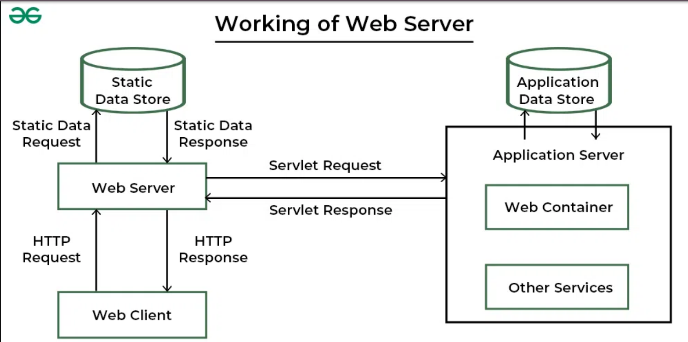

  <h1>Tugas 6 </h1>
 <h2>  Workshop Administrasi Jaringan</h2>
<strong>Web Server & Web Browser Architecture </strong>

  

Oleh:

<li>Virginia Faiqoh (3122500022)</li>

 

  Dosen Pembimbing     :  Dr. Ferry Astika Saputra ST, M.Sc

 
PROGRAM STUDI D3 TEKNIK INFORMATIKA
POLITEKNIK ELEKTRONIKA NEGERI 
SURABAYA
2023 / 2024

      

<h2>Web Server & Web Browser Architecture</h2>

<h3>Web Server</h3>

Web server adalah aplikasi perangkat lunak atau perangkat keras yang menyimpan, memproses, dan melayani konten web kepada pengguna melalui internet. Web server memainkan peran penting dalam model klien-server dari World Wide Web, di mana klien (biasanya browser web) meminta halaman web dan sumber daya, dan server merespons permintaan ini dengan mengirimkan konten yang diminta.

Proses yang terjadi di server web

1. Permintaan dan Respon HTTP
2. Penanganan Permintaan
3. Pemrosesan Server-Side
4. Penyimpanan Konten
5. Keamanan
6. Logging dan Pelaporan

Ketika pengguna memasukkan alamat web server ke dalam bilah alamat browser Chrome, browser mengirimkan permintaan HTTP ke alamat yang dituju. Permintaan ini mencakup informasi tentang jenis permintaan yang dibuat (seperti GET atau POST) dan alamat yang diminta, serta header permintaan lainnya. Web server yang dituju menerima permintaan ini di port yang sesuai (biasanya port 80 untuk HTTP dan 443 untuk HTTPS) dan memprosesnya.

Setelah memproses permintaan, server menghasilkan respons HTTP yang berisi informasi yang diminta, seperti halaman web atau data lainnya, bersama dengan kode status HTTP yang sesuai. Browser Chrome menerima respons ini dan memprosesnya, merender halaman web sesuai dengan HTML, CSS, dan JavaScript yang diterima. Konten yang diterima kemudian ditampilkan kepada pengguna.

<h2>Apa Bedanya Antara Server Aplikasi dan Server Web?</h2>

Server aplikasi dan server web memiliki tanggung jawab yang serupa namun dengan perbedaan yang penting.

Server aplikasi lebih luas dalam fungsinya karena tidak hanya terbatas pada protokol HTTP. Mereka dapat berinteraksi dengan berbagai jenis program, bukan hanya halaman web. Selain itu, server aplikasi seringkali dilengkapi dengan kemampuan tambahan yang dapat memperluas fungsionalitasnya.

Di sisi lain, server web memiliki fokus yang lebih terbatas. Tugas utamanya adalah menangani permintaan HTTP untuk menampilkan halaman web. Meskipun begitu, server web juga dapat menyediakan fitur tambahan seperti penyimpanan sementara dan layanan dasar.

Situs web dan aplikasi yang menggunakan server aplikasi biasanya membutuhkan fitur yang tidak tersedia di server web biasa. Misalnya, server aplikasi memungkinkan transaksi, personalisasi, dan layanan pesan yang penting untuk berbagai jenis situs web.

Server web sering menjadi bagian dari server aplikasi karena seringkali diperlukan untuk menyediakan layanan yang lengkap. Ketika kita berbicara tentang server aplikasi, itu juga mencakup fungsi server web.

Saat pengguna memasukkan URL ke dalam browser, server web menyajikan konten yang sama tanpa memandang lokasi pengguna atau perangkat yang digunakan. Namun, halaman web yang responsif seringkali memerlukan teknologi tambahan selain server web.

Dalam pengelolaan situs web, kombinasi server web dan server aplikasi sering memberikan hasil terbaik. Server web efektif dalam menangani permintaan dasar dan konten statis, sedangkan server aplikasi lebih cocok untuk menangani permintaan yang kompleks dan dinamis.

Jadi, meskipun server aplikasi dan server web berbeda, keduanya memiliki peran yang penting dalam menjaga kinerja situs web dan memberikan pengalaman pengguna yang baik.

<h2>DOCKER / CONTAINERIZED </h2>
Docker atau containerisasi adalah teknologi yang memungkinkan pengembang untuk mengemas aplikasi dan semua dependensinya ke dalam unit yang disebut container. Dalam konteks server aplikasi dan web, Docker atau containerisasi sering digunakan untuk menyediakan lingkungan yang terisolasi untuk menjalankan aplikasi.

Dalam kaitannya dengan server aplikasi dan web, Docker atau containerisasi tergolong dalam kategori yang berbeda dari server aplikasi dan server web. Server aplikasi dan server web merupakan infrastruktur yang digunakan untuk menjalankan dan menyajikan aplikasi serta konten web kepada pengguna akhir. Sementara itu, Docker atau containerisasi adalah teknologi yang digunakan untuk mengemas, mendistribusikan, dan menjalankan aplikasi serta layanan dalam lingkungan terisolasi yang disebut container.

Jadi, Docker atau containerisasi dapat dipandang sebagai teknologi yang menyediakan lingkungan runtime untuk menjalankan aplikasi di dalam server aplikasi atau server web. Mereka memungkinkan pengembang untuk mengemas dan mendistribusikan aplikasi dengan lebih mudah, serta memastikan konsistensi dalam lingkungan pengembangan, pengujian, dan produksi. Dengan demikian, Docker atau containerisasi memegang peran penting dalam infrastruktur modern yang memfasilitasi pengembangan dan pengiriman aplikasi yang lebih efisien dan dapat diandalkan.
