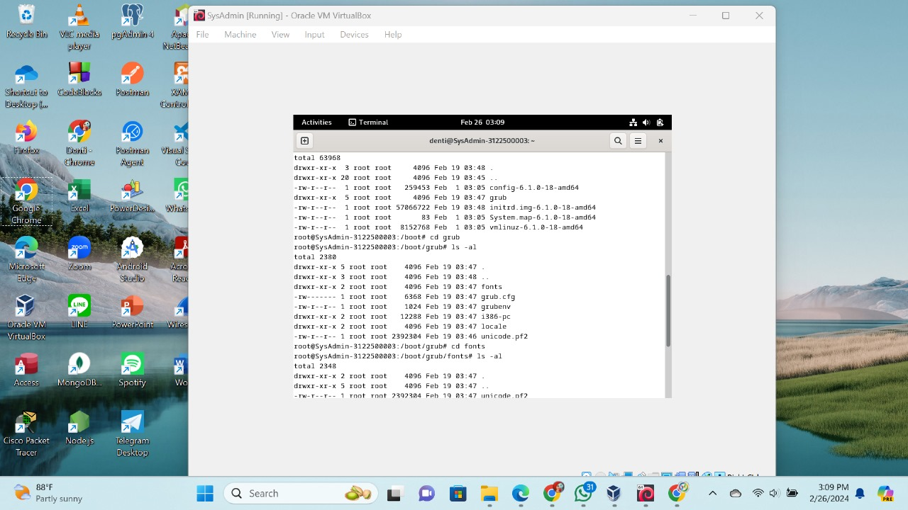

  <h1>Tugas 2</h1>
  <h2>Workshop Administrasi Jaringan</h2>
  <strong>DEBIAN</strong>

  

    
  
Oleh:

<li>Denti Widayati (3122500003)</li>
<li>Virginia Faiqoh (3122500022 )</li>
<li>Adira Callysta (3122500025 )</li>

 

  Dosen Pembimbing     :  Dr. Ferry Astika Saputra ST, M.Sc

 
PROGRAM STUDI D3 TEKNIK INFORMATIKA
POLITEKNIK ELEKTRONIKA NEGERI 
SURABAYA
2023 / 2024

      

  
1. Tulis kembali dalam bahasa Indonesia dengan gaya tulisanmu sendiri tentang standar struktur direktori dari Debian (Gunakan referensi https://www.debianadmin.com/linux-directory-structure-overview.html)! Gambarkan struktur direktori dari hasil instalasimu ! (gambar bisa menggunakan Miro, draw.io atau lainnya)

  
<mark>Jawaban : </mark>

  
 Direktori 
    Struktur direktori Unix dan Linux adalah struktur direktori seragam dimana semua direktori dikelompokkan di bawah sistem file root "/"

  <td> <ol type="1">
  <li>  “/” Root  
    Struktur direktori dimulai dengan sistem file root "/", yang sebenarnya merupakan direktori root dari keseluruhan struktur. Partisi tempat / (direktori root) berada pada sistem yang kompatibel dengan UNIX atau UNIX.   

  <li> /boot  
    Direktori /boot berisi file boot loader, termasuk grub atau lilo, file konfigurasi kernel, initrd dan system.map.   

  <li> /sys  
    Berisi file terkait kernel, firmware, dan sistem.   

  <li> /sbin  
    Berisi biner sistem dan alat manajemen sistem yang penting, untuk pengoperasian dan kinerja sistem.   

  <li> /bin  
    Berisi biner dan utilitas penting bagi pengguna  yang diperlukan untuk mode pengguna tunggal. Contohnya termasuk cat, ls, cp, dll.   

  <li> /lib  
    Menyertakan file perpustakaan untuk semua binari yang disimpan di direktori /sbin dan /bin.   

  <li> /dev  
    Direktori /dev berisi file sistem dan driver  penting.   
 
  <li> /etc  
    /etc/directory berisi file konfigurasi sistem penting seperti /etc/hosts, /etc/resolv.conf, nsswitch.conf, file konfigurasi standar, dan file konfigurasi jaringan. Ini biasanya merupakan file konfigurasi aplikasi & sistem  khusus host.   

  <li> /home  
    Semua direktori home pengguna disimpan di  direktori ini kecuali direktori home root, yang disimpan di direktori /root. Direktori ini menyimpan file pengguna, pengaturan pribadi seperti profile dll.   

  <li> /media  
    Titik pemasangan umum untuk media yang dapat dipindahkan seperti CD-ROM, USB, dan floppies.   

  <li> /mnt  
    Titik pemasangan umum untuk sistem file sementara. Ini sangat berguna  ketika memecahkan masalah seperti CD-ROM di mana Anda perlu memasang sistem file root dan mengedit konfigurasi.   

  <li> /opt  
    Direktori yang jarang digunakan di Linux untuk paket perangkat lunak opsional. Ini biasanya digunakan pada sistem operasi UNIX, seperti Sun Solaris, di mana paket perangkat lunak diinstal.   

  <li> /usr  
    Subhierarki sistem file root, direktori data pengguna. Berisi utilitas dan aplikasi khusus.   

  <li> /usr/sbin  
    Berisi biner  yang tidak penting dan tidak penting untuk utilitas sistem dan jaringan.   

  <li> /usr/lib  
    File perpustakaan untuk binari di direktori /usr/bin dan /usr/sbin.   

  <li> /usr/share  
    Direktori data bersama yang tidak bergantung pada platform.   

  <li> /usr/local  
    Subhierarki di bawah direktori /usr yang berisi data spesifik sistem lokal, termasuk biner pengguna dan sistem serta pustakanya.   

  <li> /var  
    Direktori Sebagian besar diinstal sebagai sistem file terpisah di direktori root tempat semua konten variabel seperti log, file spool  printer, crontab, pekerjaan, mail, proses yang berjalan, file kunci, dll.   

  <li> /tmp  
      Sistem file sementara untuk menyimpan file sementara yang dibersihkan saat sistem di-restart. File sementara juga disimpan di direktori /var/tmp.   

<h3><mark>Berikut adalah gambar visual dari directory root<mark></h3>

     
 
   

 
    

  
    

  
      

  
    

  
    

  
    

  
    

  