
# Administrasi Jaringan  dasar system administrasi (DEBIAN 12)
# 
                                       Kelompok 9 :
                              Denti Widayati (3122500003)
                              Virginia Faiqoh (3122500022)
                              Adira Callysta (3122500025)
---
# Soal no.2
Buat slide dalam bahasa Indonesia dengan gaya bahasamu sendiri tentang dasar system administrasi ! Gunakan referensi buku : (Debian12- SysAdmmin.pdf) ! Akan lebih baik apabila anda menggunakan MARP!

---
# Metode Pada Debian
Debian GNU/Linux menggunakan metodologi repositori untuk mendistribusikan aplikasi. Metodologi ini memungkinkan sentralisasi perangkat lunak dan penggunaan antarmuka sederhana untuk mengatur dan meningkatkan sistem, tidak perlu mengunjungi situs perangkat lunak itu sendiri.

---
# 1.1	The sources.list file
1. Alamat Internet repositori Debian disimpan dalam file: /etc/apt/sources.list, serta file bertipe /etc/apt/sources.list.d/xxx.list.
2. Untuk mengedit dan memodifikasi file source.list,
# 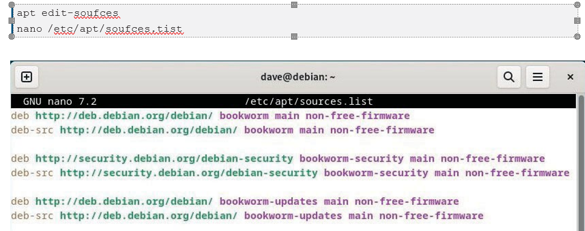
---
#
• “deb”: berarti repositori biner (perangkat lunak yang dikompilasi itu sendiri)
• “deb-src”: berarti repositori sumber (file kode program yang digunakan untuk mengkompilasi perangkat lunak)
• “http:…” atau “https:…”: alamat Internet server repositori
• “kutu buku” atau “keamanan kutu buku”: adalah cabang dalam pohon repositori
• “main” atau “non-free-firmware”: bagian repositori.

---
# 1.2 About repositories, branches and sections/components

Debian mengatur paket perangkat lunaknya di dalam repositori. Repositori ini dibagi menjadi cabang dan bagian/komponen.
Ada 4 bagian di repositori resmi Debian:

• main: mematuhi DFSG tanpa ketergantungan “tidak bebas”.
• firmware non-bebas: firmware non-bebas disertakan secara default sejak Debian 12
• contrib: mematuhi DFSG dengan beberapa dependensi “tidak bebas”.
• tidak bebas: tidak mematuhi DFSG, DFSG (Pedoman Perangkat Lunak Bebas Debian):

---
# 1.3 Backport packages
Debian juga menawarkan beberapa repositori khusus yang disebut backports, yang berisi versi terbaru dari beberapa aplikasi. Repositori ini tidak diaktifkan secara default, tetapi tidak menimbulkan risiko khusus apa pun bagi sistem.

Backport adalah mekanisme yang memungkinkan aplikasi yang saat ini disimpan di repositori pengembangan Debian, untuk di-porting kembali ke versi “stabil”.

Misalnya: pengembang Debian mengambil versi terbaru LibreOffice dari repositori pengembangan

---
# 1.4 Modifying the Repositories
risiko menggunakan komponen “kontrib” atau “tidak bebas” dari cabang yang diarsipkan :
• kurangnya kebebasan untuk paket semacam ini
• kurangnya dukungan dari proyek Debian (tidak dapat memelihara perangkat lunak tanpa memiliki kode sumbernya)
• kontaminasi sistem Debian Anda yang sepenuhnya gratis.
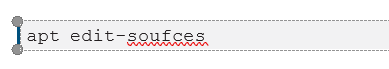

---
Contoh entri baris untuk paket gratis dan Contoh entri baris untuk paket gratis dan paket berpemilik:
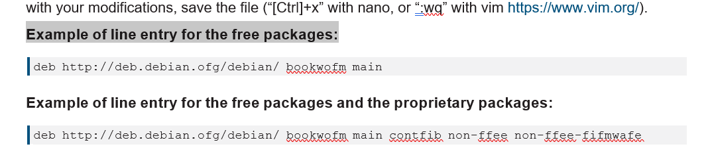

Bagian berikut menyajikan perintah dasar untuk mengelola paket de Debian dengan APT (Advanced
Alat Paket) dalam emulator terminal. 
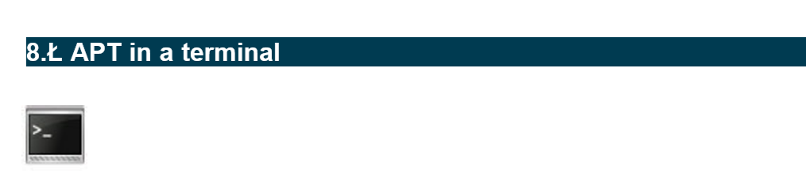

---

# 1.5 User’ command to search and display information
Perintah pengguna untuk mencari dan menampilkan informasi

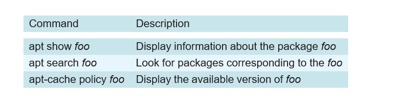

---
# 1.6 Administrator’ mode commands for system maintenance
•Perintah mode 'Administrator' untuk pemeliharaan sistem
Perintah-perintah ini harus dijalankan dengan hak administrator “root”, karena berdampak pada sistem. Untuk berpindah ke mode administrator dari terminal, ketik “su -”: kata sandi administrator diminta.

---
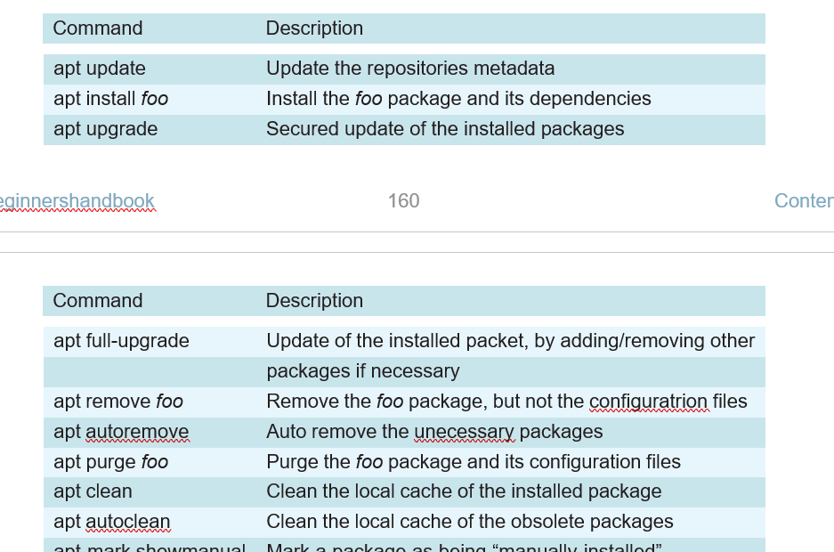

---
Baris perintah All-in-One (dalam mode administrator) untuk memperbarui informasi repositori + memperbarui sistem + membersihkan paket dalam cache

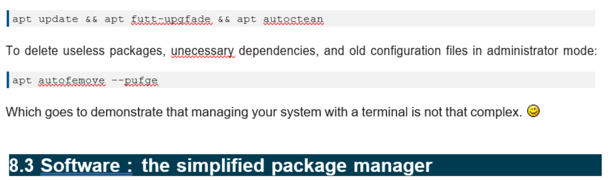

Baris perintah All-in-One (dalam mode administrator) untuk memperbarui informasi repositori + memperbarui sistem + membersihkan paket dalam cache:

---
# 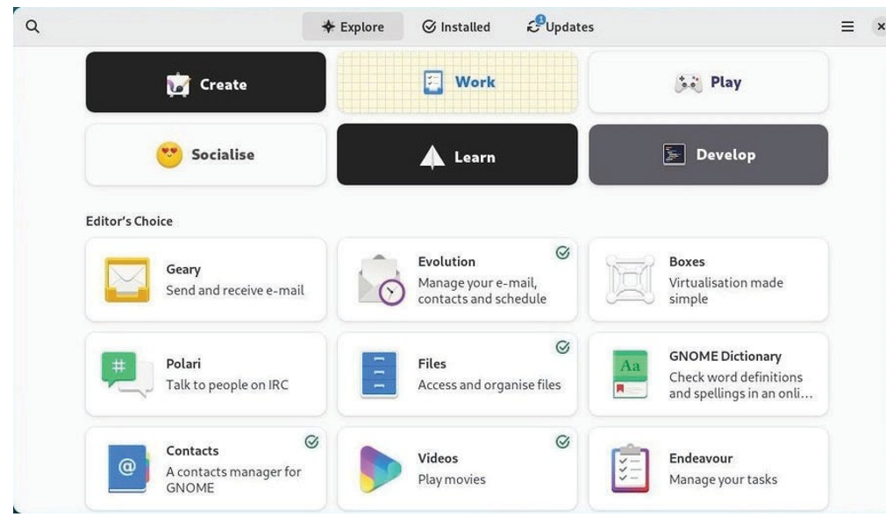
---
# 1.7Software: searching an application

dengan mengklik tombol pencarian (simbol kaca pembesar), atau dengan memilih salah satu kategori yang ditampilkan:
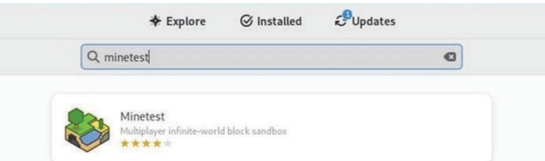

---
# 1.8 Software: installing an application

Menginstal aplikasi hanya dengan mengklik area deskripsinya dan kemudian pada tombol “Instal”. Kata sandi administrator akan diminta. Anda dapat mengikuti kemajuan instalasi di jendela utama dan kemudian meluncurkan langsung aplikasi yang baru diunduh.

---
#
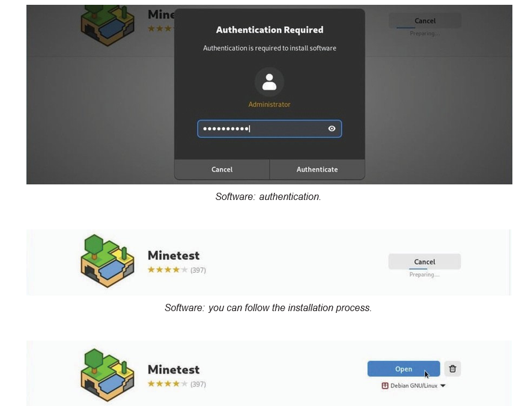

---
# 1.9 Software: removing an application

Menghapus Instalasi aplikasi hanya dengan mengunjungi kategori “Terpasang” (di bagian atas antarmuka) dan kemudian dengan mengklik tombol “Hapus”. maka akan dimintai konfirmasi:

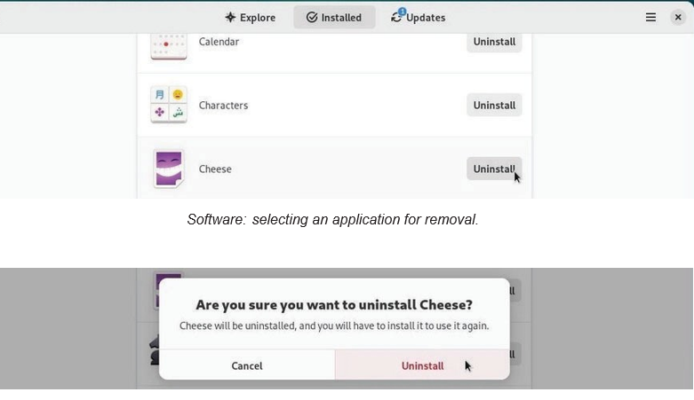

---
# 1.10 Software: upgrading your applications

Memperbarui sistem dari bagian khusus “Pembaruan” akan menunjukkan pembaruan yang tersedia dan/atau sudah diunduh. Jika tidak ada pembaruan yang tersedia, dapat memeriksa repositori dengan menggunakan tombol khusus di kiri atas.

Dalam contoh, serangkaian pembaruan termasuk “pembaruan sistem operasi” memerlukan reboot. dengan mulai dengan mengunduh paket untuk diperbarui

Perhatikan bahwa untuk pembaruan yang lebih ringan, restart tidak diperlukan.
Setelah reboot, jendela pesan di desktop memberitahu Anda bahwa instalasi berhasil.

---

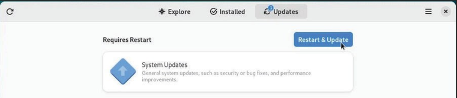  
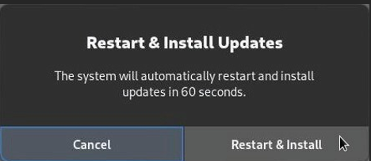  
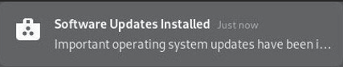

---
# 1.11 Software: modify packages repositories

Aplikasi “Perangkat Lunak” cukup sederhana, namun tetap memungkinkan untuk mengkonfigurasi repositori secara grafis. Dari menu, pilih “Repositori”. dapat menambahkan sumber “tidak bebas” dan/atau menentukan frekuensi pembaruan repositori. Informasi alamat repositori yang ditampilkan berasal dari file source.list 

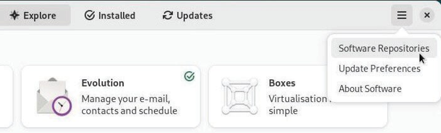  

---

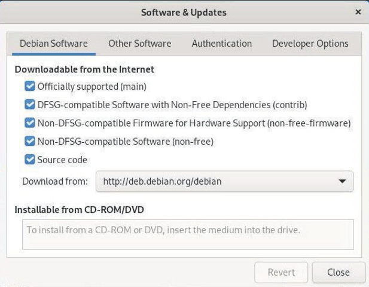  

--- 

Setelah repositori  dimodifikasi, Anda harus memuat ulang paket informasi. Sebuah pesan meminta Anda

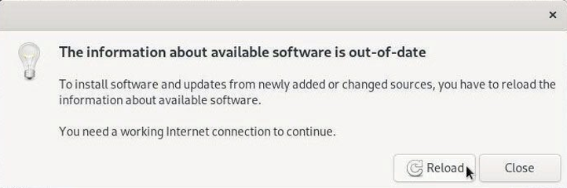  
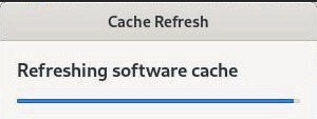

---
# 1.12 Automatic updates with Software

Untuk memanfaatkan sistem tanpa mengkhawatirkan pembaruan, dapat mengaktifkan mekanisme pembaruan otomatis. Dari menu “Perangkat Lunak”, pilih “Preferensi Pembaruan”. Entrinya cukup jelas

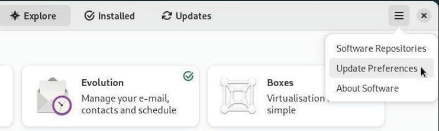

---

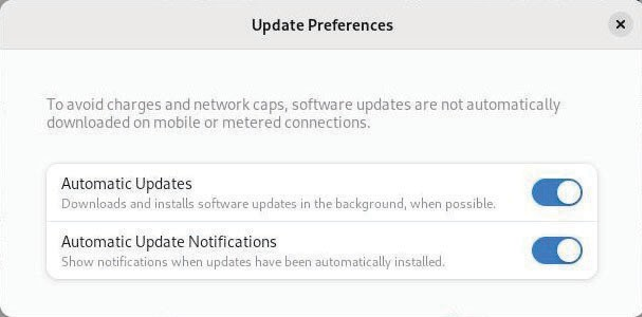

---
# 1.13	Discover: the KDE package manager
Gnome menggunakan "Perangkat Lunak" untuk mengelola aplikasi dengan cara yang disederhanakan. 
Discover memungkinkan  mencari, menginstal, menghapus, atau memperbarui aplikasi dari satu antarmuka. juga dapat memodifikasi sumber perangkat lunak untuk menginstal - atau tidak - beberapa aplikasi tidak bebas.
Discover diluncurkan hanya dari menu utama KDE > Aplikasi> Sistem > Pusat Perangkat Lunak

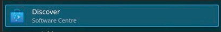

---

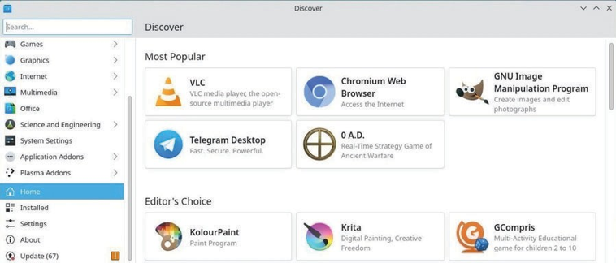

---
# 1.13 Search and install with Discover
Untuk menemukan aplikasi, ketikkan namanya di kolom pencarian khusus atau kunjungi berbagai kategori Discover. Kemudian klik tombol “Instal” sudah cukup:

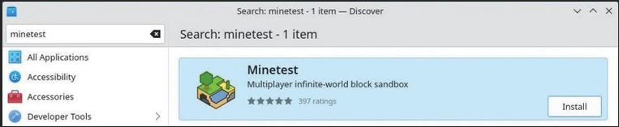

konfirmasi untuk tindakan apa pun pada perangkat lunak bersama dengan kata sandi administrator. Prosesnya kemudian akan diluncurkan di latar belakang. Anda dapat mengikuti perkembangan modifikasi di area notifikasi KDE.

---

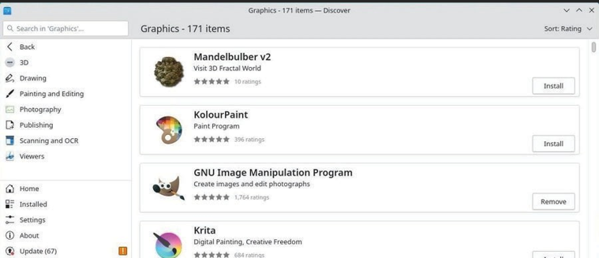

---
# 1.14 Install Plasma desktop widgets and addons

Discover memungkinkan untuk menambahkan komponen tambahan ke lingkungan Plasma . Untuk mencapai hal ini, kunjungi bagian “Add-on plasma”

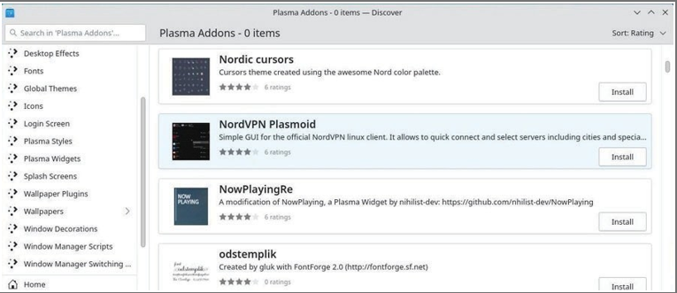 

---

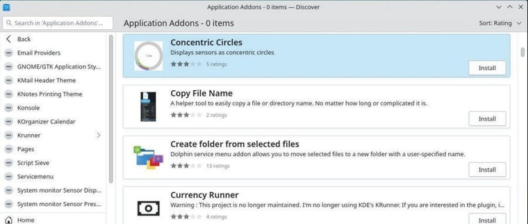

---
# 1.15 Uninstalling an application with Discover

Dengan Discover, cukup kunjungi kategori “Terpasang” lalu klik “Hapus”

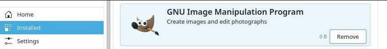

---
# 1.16 Discover: updating your applications

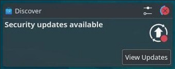

Saat KDE memberi tahu tentang satu atau lebih pembaruan, “Temukan”-lah yang melaksanakannya. Untuk memeriksa pembaruan “secara manual”, klik tombol khusus:

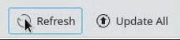

Cukup klik “Perbarui semua” dan konfirmasi dengan kata sandi administrator.

---

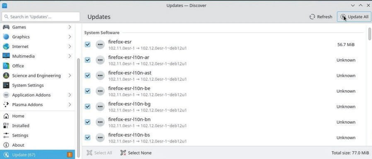  
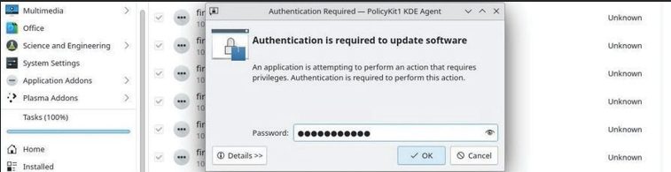  

---

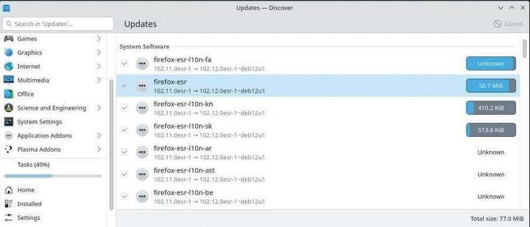  

Begitu pula dengan manajemen perangkat lunak, Anda dapat mengikuti prosesnya di dalam area notifikasi KDE. Dan sebuah pesan akan memberi tahu Anda di akhir proses.

---
# 1.17 Discover: managing repositories

 Buka bagian “Pengaturan” di Discover, entri menampilkan alamat repositori dari sumber Anda.list :
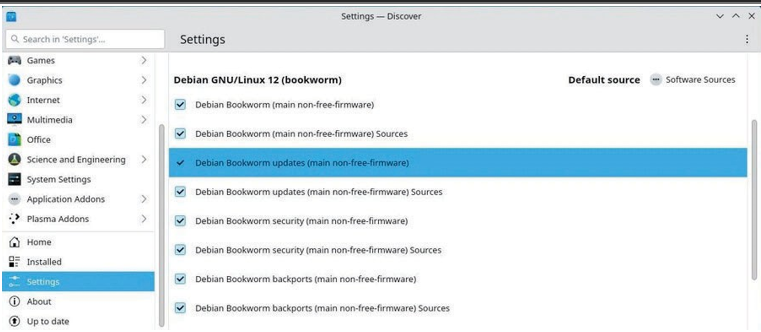 

---
# 1.18 Synaptic: the comprehensive package manager

 Synaptic adalah antarmuka grafis komprehensif dari manajer paket Debian. Hal ini memungkinkan visi total dari paket yang diusulkan, baik diinstal atau tidak. Ini jauh lebih rinci daripada Pusat Perangkat Lunak, atau Discover (lihat bab sebelumnya) karena ini menampilkan paket lengkap yang tersedia (termasuk perpustakaan).

• Menyediakan fungsi yang sama seperti apt.
• Anda perlu memasukkan kata sandi administrator untuk membuka dan menggunakan Synaptic.
• Koneksi Internet aktif juga diperlukan untuk menginstal atau memperbarui perangkat lunak Anda.

---

# 1.18 Synaptic: Main interface

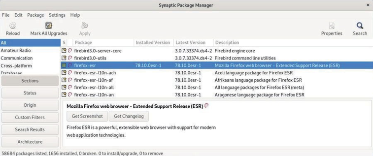

Jendela Synaptic dibagi menjadi 4 area: bilah alat di bagian atas, panel kiri yang memungkinkan berbagai cara menyortir dan memilih paket, panel tengah menampilkan daftar paket itu sendiri, dan di bawahnya, panel yang menampung deskripsi paket saat ini paket yang dipilih (pemilihan dilakukan dengan satu klik).

---

Di depan setiap paket, Anda melihat sebuah kotak kecil (putih untuk paket yang belum diinstal, hijau jika diinstal, merah jika rusak). Di sebelah kotak status ini, logo Debian menunjukkan bahwa paket ini “gratis” (seperti dalam kebebasan). Selain itu, pesan yang meminta konfirmasi akan selalu ditampilkan terlebih dahulu.
Hal pertama yang harus dilakukan saat Anda meluncurkan Synaptic adalah mengklik tombol “Reload” untuk memperbarui semua informasi (metadata) mengenai repositori, paket, dan aplikasi yang tersedia.

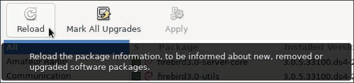

---
# 1.20 Managing the repositories with Synaptic
Repositori memungkinkan untuk memperbarui dan menginstal paket tambahan.
Repositori telah dikonfigurasi selama proses instalasi tetapi dapat mengelolanya kapan saja
 
waktu, jika perlu. Buka manajer paket Synaptic (menu Sistem > Manajer paket Synaptic). Di bilah menu atas, klik “Pengaturan, lalu” Repositori”.

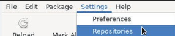

--- 

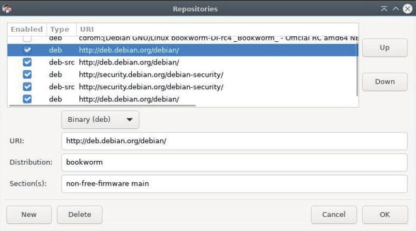

Setelah modifikasi dapat divalidasi, aplikasi akan mengundang untuk memuat ulang daftar repositori agar perubahan yang dapat diperhitungkan.
Perhatikan bahwa jika Anda ingin menggunakan antarmuka sederhana “hanya kotak centang” di salah satu desktop Xfce, LXDE, atau LXQt, Anda perlu menginstal paket “software-properties-gtk”.

---

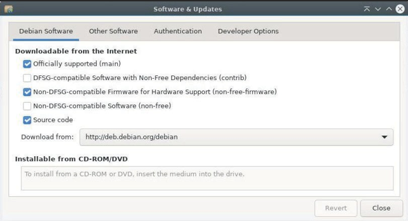

---
# 1.21 Updating the system with Synaptic

Sebelum memperbarui sistem, perlu untuk “Muat Ulang” daftar paket, dengan mengklik tombol yang sesuai, atau dengan masuk ke menu “Edit > Muat Ulang Informasi Paket” (atau bahkan [Ctrl]+r jika Anda ingin menggunakan a pintasan keyboard). Tindakan ini memeriksa apakah versi paket yang ada di sistem Anda adalah yang terbaru atau tidak.

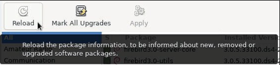

---

Kemudian klik “Tandai Semua Peningkatan” atau masuk ke menu “Edit > Tandai Semua Peningkatan…”.
Jika tidak terjadi apa-apa, setelah Anda mengklik “Tingkatkan semuanya”, ini berarti sistem Anda sudah mutakhir. Anda dapat menutup Sinaptik.
Jika beberapa paket untuk diinstal atau diperbarui tersedia, paket tersebut akan ditentukan. Anda dapat melihatnya dengan memilih bagian “Status” > “terinstal (dapat diupgrade)”:

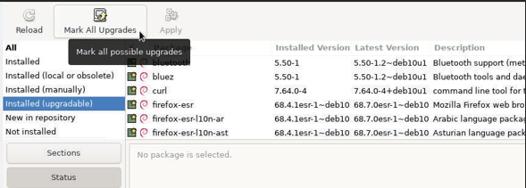

---
Sebuah jendela baru akan muncul dengan daftar paket yang akan diupgrade serta dependensi tambahannya, jika diperlukan:

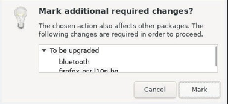

---
Setelah itu hanya perlu mengklik tombol “Tambahkan ke pilihan” lalu “Terapkan”, dan menerima konfirmasi yang diminta:

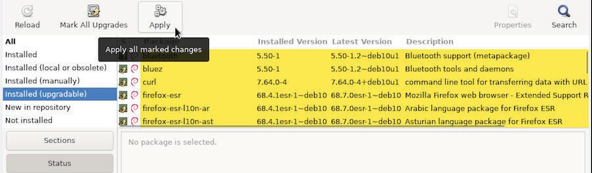  
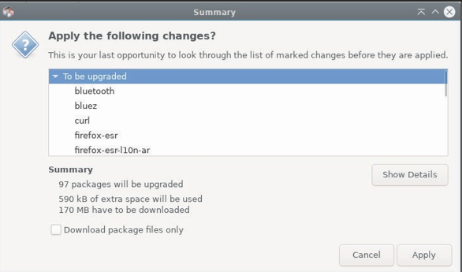

---

Proses pembaruan sistem dimulai dengan mengunduh paket, dan dilanjutkan dengan instalasinya.

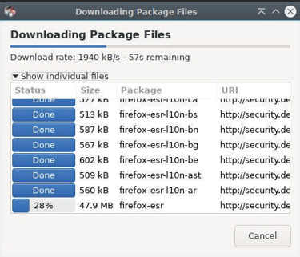

Sebuah pesan memberitahu Anda bahwa semua perubahan telah diterapkan.

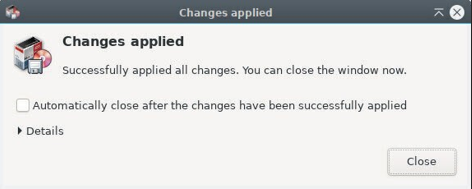

---
# 1.22 Searching for a software

jika sedang mencari sesuatu dengan tepat, klik tombol pencarian (di bilah atas) dan masukkan kata kunci pencarian  di jendela yang terbuka.

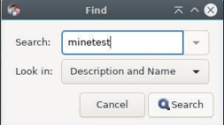

 jika Anda mencari permainan, klik Bagian di bagian bawah panel kiri, gulir ke bawah ke bagian “Permainan dan Hiburan”, klik di atasnya, dan semua paket mengenai permainan dan hiburan akan muncul di panel tengah.

 ---
 # 1.23 Installing a package with Synaptic

 Untuk menginstal satu atau beberapa paket, klik kanan pada kotak kecil di depan nama paket, dan pilih opsi “Tandai untuk Instalasi”.

 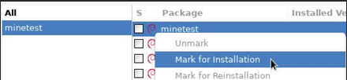

 Jika, agar dapat berfungsi, paket ini memerlukan instalasi paket lain (dependensi yang terkenal), paket tersebut secara otomatis ditambahkan ke pilihan.

 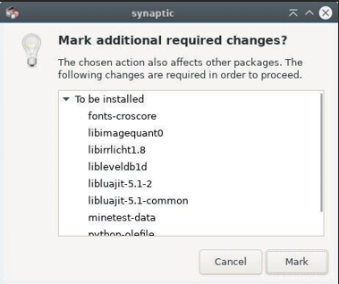

 ---
 
 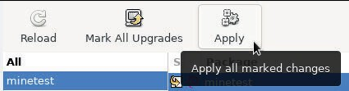

 Kemudian, Anda hanya perlu mengklik tombol “Terapkan”, dan mengonfirmasi ringkasan perubahan yang akan diterapkan.

 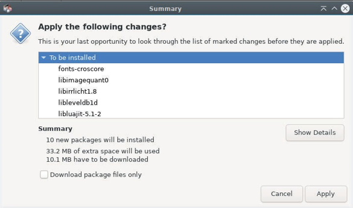

---

Paket diunduh dan diinstal. Anda dapat mengikuti seluruh proses dalam antarmuka sinaptik:

  

 ---
 # 1.24	Reinstall a package
ingin menginstal ulang paket yang sudah terinstal. Dalam hal ini pilih opsi “Tandai untuk Instal Ulang”. Hal ini memungkinkan, misalnya, memulihkan konfigurasi default untuk aplikasi jika Anda memodifikasinya.

---
# 1.25 Uninstall a package with Synaptic
Seperti untuk instalasi, klik kanan pada kotak kecil di depan nama paket, dan pilih opsi “Mark for Removal”. Kemudian klik "Terapkan".
Penghapusan sederhana akan menyimpan file konfigurasi paket di sistem , jika  ingin menginstalnya kembali nanti.
Untuk menghapus juga file konfigurasi pilih opsi “Tandai untuk Penghapusan Lengkap” (setara dengan “pembersihan” di baris perintah terminal)

---
# 1.26 Synaptic: cleaning useless packages

Seringkali, ketika perangkat lunak di-uninstall, beberapa paket (dependensi) tetap berada di sistem dan tidak berguna lagi, karena semua paket yang memerlukannya telah hilang. Paket-paket tidak berguna ini dapat dengan mudah dihapus dengan Synaptic.
 
Saat Synaptic diluncurkan, klik tombol “Status” di bagian bawah panel kiri. Jika kategori “Terpasang (Dapat dilepas secara otomatis)” muncul, klik kategori tersebut untuk menampilkan paket yang sesuai (lihat gambar di bawah):

---

selanjutnya adalah klik kanan pada setiap paket di panel tengah, dan pilih opsi “Tandai untuk Penghapusan Lengkap”. Setelah semua paket ditandai, klik tombol “Terapkan”.

---
# 1.27 Removing configuration residues

Meskipun seseorang memilih untuk menghapus perangkat lunak sepenuhnya, beberapa sisa konfigurasi mungkin masih tertinggal di sistem, namun residu tersebut juga dapat dengan mudah dihapus dengan Synaptic.
Klik tombol "Status" di bagian bawah panel kiri. Jika kategori “Tidak diinstal (konfigurasi sisa)” muncul, pilih kategori tersebut.
Yang harus Anda lakukan selanjutnya adalah klik kanan pada setiap paket di panel tengah, dan pilih opsi “Tandai untuk Penghapusan Lengkap”. Setelah semua paket ditandai, klik tombol “Terapkan”.

 ---
 # 1.28 Look at detailed information on a package

 Dengan mengklik sebuah paket, deskripsinya ditampilkan di panel tengah bawah Synaptic. Untuk mendapatkan lebih banyak informasi tentang suatu paket, klik kanan padanya, dan pilih Properties, atau masuk ke menu “Packages > Properties”.

---
# 1.30 Synaptic preferences

Preferensi” adalah kategori yang terkenal, ada di sebagian besar aplikasi, dan juga ada di sini… Namun perlu diingat bahwa Synaptic adalah kasus yang sangat khusus: ia mengelola set lengkap perangkat lunak yang diinstal pada sistem Anda. Saat Anda menghapus sebuah program, program tersebut tidak akan masuk ke keranjang sampah (tempat Anda berpotensi mengambilnya kembali)!
Setelah peringatan menakutkan ini, mari beralih ke pengaturan yang tersedia untuk Synaptic. jendela Preferensi (diluncurkan melalui menu Pengaturan > Preferensi) menampilkan 6 tab berbeda:

---

---
• Umum: pilihan di dalamnya agak eksplisit. Catatan:dapat menghapus centang pada opsi “Pertimbangkan paket yang direkomendasikan sebagai dependensi”, jika itu membantu mempertahankan sistem ultra-ringan. Namun hal ini dapat menimbulkan masalah saat menginstal paket baru di masa mendatang. Jadi pilihan untuk ditangani dengan hati-hati.
• Kolom dan Font: memungkinkan Anda menampilkan/menyembunyikan beberapa kolom dalam daftar paket, dan menentukan font, jika perlu.
• Warna: di sini Anda dapat menentukan warna paket sesuai dengan statusnya.

---
• File: Saat  menginstal suatu perangkat lunak, perangkat lunak tersebut terlebih dahulu disimpan dalam cache (yang merupakan folder tertentu pada sistem file) sebelum dikompresi dan diinstal. Paket-paket ini dapat menempati lebih banyak ruang disk saat Anda menggunakan komputer Anda. Di sini Anda dapat segera menghapusnya atau mengonfigurasi tindakan otomatis.
• Jaringan: Ini adalah cara Synaptic terhubung ke Internet. Anda harus tahu jika situasi memerlukan modifikasi parameter ini.
• Distribusi: Mendefinisikan perilaku upgrade paket dan sangat eksplisit. Jika ragu, jangan memodifikasinya!

---
# 1.31	Disk space information

Hal pertama yang harus dilakukan tentu saja adalah mengetahui ruang yang terpakai di disk Anda. Beberapa alat tersedia untuk Anda, dimulai dengan terminal Anda:
# – Disk space in terminal mode –
Ringkasan penggunaan ruang disk untuk setiap titik pemasangan sistem (disk dan partisi) dengan perintah df:

---

# –	List your repertories sorted by decreasing size –
Lihat direktori Anda dalam jumlah besar berkat du dan sortir (satuannya adalah megabita):

# –	Ncdu –
Penganalisis ruang disk dalam mode konsol. Untuk meluncurkannya, cukup ketik “ncdu” di terminal Anda. Untuk menginstal perangkat lunak ini (dalam mode administrator):

---
# –	Baobab –
Penganalisis ruang disk dalam mode grafis, terintegrasi di Gnome tetapi tersedia di lingkungan lain dengan:

---
# 1.32 Cleaning the packages

Apt/aptitude/dpkg adalah manajer paket Debian yang biasa. Saat Anda menginstal sebuah paket, file sumber arsip/debnya disimpan di sistem Anda (dalam folder /var/cache/apt/archives/) untuk memungkinkan kemungkinan instalasi ulang tanpa koneksi Internet. Untuk membersihkan "apt cache" gunakan perintah sederhana dalam mode administrator

Setelah cache dari paket yang diinstal dibersihkan, Anda juga dapat menghapus paket yang tidak berguna dari sistem Anda, serta file konfigurasi. Peringatan! Ingatlah untuk memeriksa dengan cermat daftar paket yang direncanakan untuk dihapus, sebelum menerima operasi

---

Jika telah mengupgrade sistem Anda, ada kemungkinan beberapa paket tidak lagi tersedia di repositori baru: paket tersebut sudah usang. Untuk membuat daftar dan menghapus paket-paket ini, gunakan apt dan ingatlah untuk memeriksa dengan cermat daftar paket yang direncanakan untuk dihapus

Terakhir, untuk membuat daftar dan membersihkan file konfigurasi yang tetap ada meskipun aplikasi telah dihapus.

dapat menginstal alat deborphan yang mencantumkan paket-paket yatim piatu di sistem: paket-paket yang tidak bergantung pada paket lain. Peringatan! Ingatlah untuk memeriksa dengan cermat daftar paket yang direncanakan untuk dihapus, sebelum menerima operasi.

---
# 1.33 Emptying the trash bins

Tiga tempat sampah (atau keranjang sampah) yang berbeda harus dipertimbangkan:
Keranjang sampah pengguna : ~/.local/share/Trash/ . Anda dapat mengosongkannya dengan pengelola file sistem (bab.3.6.2.5), atau dengan terminal

Keranjang sampah administrator : /root/.local/share/Trash/ . Untuk mengosongkannya dengan cara yang benar, gunakan terminal dalam mode administrator

Keranjang sampah eksternal : terletak di disk eksternal Anda, biasanya diberi nama '/media/y- our_id/your_disk/.Trash_1000', dimana your_id sesuai dengan nama login Anda.

---
# 1.34 Purging application caches

Beberapa aplikasi menggunakan folder “cache”, tempat mereka menyimpan gambar, video, dan informasi lain-lain agar dapat berjalan lebih cepat. Biasanya data ini tidak memakan terlalu banyak ruang disk, namun jika (menggunakan alat yang dijelaskan di atas) Anda mendeteksi bahwa suatu folder menjadi terlalu tebal, jangan ragu untuk menghapusnya.

Setiap aplikasi mempunyai caranya sendiri untuk mengelola cache-nya sendiri: beberapa membersihkannya secara sistematis ketika ditutup, yang lain menyimpan datanya di folder /tmp, yang akan dibersihkan selama sesi logout, yang lain menyimpan semua informasinya dalam folder tertentu.
Untuk Firefox, misalnya, Anda dapat membersihkan cache dari menu preferensi, dan bahkan mengotomatiskan tindakan ini setiap kali aplikasi ditutup.

---
# 1.35 Purging the thumbnails

Setiap kali membuka folder yang berisi gambar atau video, thumbnail dibuat untuk mewakili file grafik tersebut. Thumbnail ini disimpan dalam folder tertentu untuk digunakan kembali, daripada dipaksa untuk menghitung ulang setiap kali Anda mengakses file semacam ini.
Masalah muncul ketika Anda menghapus file grafik, karena thumbnail-nya disimpan di sistem, dan ini menyebabkan sejumlah ruang disk terbuang untuk menyimpan thumbnail yang sudah usang.
Untuk membersihkannya, cukup dengan menghapus folder terkait:

--- 

Debian GNU/Linux menggunakan sistem repositori paket untuk mengelola perangkat lunak dengan lebih baik dan meningkatkan keamanan sistem Anda. Namun mungkin saja Anda memerlukan paket eksternal

deb adalah kependekan dari “debian”, perusahaan induk. Untuk mendistribusikan perangkat lunaknya, Debian menggunakan format file arsip tertentu: “.deb”. Ini adalah format terkompresi, seperti “.zip” yang Anda gunakan untuk menyimpan data Anda. Arsip “.deb” ini dikenali oleh manajer paket Debian yang berbeda (APT dan antarmuka grafisnya Synaptic) sehingga dapat ditangani dengan lebih mudah.

---
# 1.36 Installation in graphic mode with GDebi

GDebi adalah utilitas grafis yang memungkinkan instalasi paket eksternal berformat “.deb”, sekaligus mengelola dependensinya.
Untuk menginstalnya, cari “gdebi” di manajer paket favorit Anda (Synaptic, Discover, Software) atau lebih sederhana dari terminal dalam mode administrator menggunakan “su”

Saat Anda mengunduh paket eksternal Debian, klik kanan padanya dan pilih “Buka dengan gdebi”.

---

Di dalam menu, klik File > Buka dan masukkan jalur file “.deb”:
 

Kemudian klik "Instal Paket". Kata sandi Anda diminta untuk memvalidasi pemasangan.
 

---
 

Untuk uninstallnya sangat mudah : cukup klik “Remove Package”.
 

---
# 1.37 Installation in terminal mode with Dpkg

Dpkg adalah utilitas perangkat lunak yang menangani paket, seperti halnya apt, tetapi tanpa mengelola dependensi. Artinya jika Anda menggunakan dpkg untuk menginstal paket eksternal, Anda perlu menginstal paket “dependen” satu per satu dari terminal Anda. Dpkg terintegrasi di Debian secara default, dan harus digunakan dalam mode administratif. Untuk menginstal paket eksternal 

---

Distribusi GNU/Linux. Tujuannya adalah untuk menyediakan lingkungan “sandbox” yang aman, terisolasi dari seluruh sistem, di mana pengguna dapat menjalankan aplikasi yang tidak divalidasi oleh repositori distribusi (misalnya, versi pengujian).
 
---

Aplikasi yang Anda unduh dari repositori Debian adalah arsip berformat “.deb” yang berisi aplikasi itu sendiri. Aplikasi-aplikasi ini menggunakan dependensi umum, terhubung satu sama lain, dan memiliki akses ke seluruh sistem Anda. Repositori Debian aman, jadi jangan khawatir tentang masalah ini. Tapi mengapa kita harus menggunakan Flatpak?
Format Flatpak bekerja secara berbeda: aplikasi dikompresi dengan semua dependensinya, menjadikannya sepenuhnya independen dari sistem yang menginstalnya. Jadi, di sini Anda dapat menginstal dan menggunakan aplikasi yang baru diperbarui atau bahkan yang baru, dibandingkan dengan repositori Debian.

---
 
Keuntungan kedua dari format ini adalah “kotak pasir” yang terkenal. Kotak pasir adalah sejenis kotak aman tempat aplikasi berjalan, tanpa memiliki akses ke seluruh sistem (dengan pengecualian, ketika pengguna memberikan otorisasinya), sehingga mencegah perangkat lunak berbahaya memasuki aplikasi Anda untuk mencemari sistem Anda.
Keuntungan terakhir adalah memungkinkan Anda menjalankan beberapa versi dari aplikasi yang sama (sangat praktis untuk Minetest dan server dalam versi berbeda).
Kelemahan dari format ini adalah tidak diverifikasi oleh keamanan Debian: saat memasang flatpaks, Anda sebaiknya memilih aplikasi referensi tepercaya (Gimp, VLC, Blender…).

---
# 1.38Installing Flatpak

Untuk memanfaatkan aplikasi dalam format Flatpak, Anda harus menginstal paket yang sesuai terlebih dahulu. Dari terminal Anda dalam mode administrator
gambar 

---

Anda sekarang dapat mengunduh dan menginstal paket flatpak dengan mengunjungi salah satu situs web yang mengelompokkan aplikasi ini seperti Flathub (https://flathub.org/home). Namun cara paling sederhana adalah menambahkan repositori ke sumber Anda untuk memanfaatkan daftar aplikasi lengkap tanpa harus mencari melalui situs.

---
# 1.39 Add a Flatpak repository

Untuk menambahkan repositori seperti Flathub misalnya, dan mendapatkan keuntungan dari pencarian yang mudah dan instalasi yang disederhanakan, ketik terminal Anda:

Anda akan dimintai kata sandi administrator. Dan Anda harus me-restart sistem Anda untuk memperhitungkan perubahan.

---
# 1.40 Manage Flatpak applications under Gnome with Software 

Untuk memanfaatkan pengelolaan flatpak dalam manajer perangkat lunak Anda, Anda harus menambahkan plugin yang sesuai dengan lingkungan Anda. Untuk Gnome dan pengelola perangkat lunaknya yang disederhanakan, dalam mode terminal dan administrator

 
 

---

# 1.41 Manage Flatpak applications under KDE with discover

Untuk memanfaatkan pengelolaan flatpaks dalam Discover, di bawah Kde, Anda harus menginstal plugin yang sesuai. Di terminal dan dalam mode administrator

sekarang dapat mengelola flatpak Anda seperti aplikasi lainnya (lihat bab.8.4).
Selama pencarian Anda, Anda harus mengklik file perangkat lunak. Jangan langsung klik “Instal” karena repositori Debian memiliki prioritas.

 

---

# 1.42 Manage Flatpak applications from your terminal

Selanjutnya, perintah dasar untuk mengelola flatpaks Anda dari terminal Anda:

 

---

# 1.43 Remove a Flatpak application

Jika Anda telah menginstal flatpak secara grafis dari Perangkat Lunak atau Discover, hapus saja dari menu aplikasi yang diinstal dari manajer perangkat lunak Anda: cari flatpak yang akan dihapus instalasinya, lalu mulai penghapusan dari tombol khusus.
Perhatikan bahwa jika Anda ingin menghapus semua dependensi (perangkat lunak yang diinstal selain flatpak untuk pengoperasiannya), Anda harus menjalankan perintah ini di terminal Anda:

---
# 1.44 Some Flatpak repositories

Untuk membantu dalam penelitian, selanjutnya temukan beberapa repositori yang menggunakan format Flatpak dan perintah yang harus dijalankan untuk menambahkan repositorinya. Anda dapat menggunakan opsi “--if-no-exists” untuk menghindari kesalahan yang disebabkan oleh duplikat:

 

---

# 1.45 Who is the Sid guy?

Pertama-tama, kita harus tahu bahwa beberapa cabang distribusi Debian ada secara paralel.
Yaitu distribusi oldstable, stable, testing dan stable, serta cabang eksperimental.
Distribusi Stabil adalah distribusi resmi Debian yang dirilis saat ini, yang dipelihara dan diperbarui oleh tim Debian. Satu-satunya perubahan yang dilakukan berkaitan dengan pembaruan keamanan dan perbaikan bug. Disarankan untuk memilih versi ini.

Distribusi Oldstable adalah versi stabil sebelumnya. Biasanya didukung oleh tim Debian selama satu tahun setelah rilis versi stabil baru. Namun, lahan tersebut mungkin akan bertahan lebih lama jika cukup banyak individu atau perusahaan yang terus memastikan pemeliharaannya. Kemudian disebut distribusi LTS (singkatan dari Long Term Support) kami memperpanjang umurnya.

--- 

Distribusi Pengujian adalah versi Stabil yang akan datang. Ini digunakan untuk menyiapkan versi stabil berikutnya. Ketika semuanya baik-baik saja, ketika semua bagian berfungsi dengan baik bersama-sama, ketika semua fitur yang ditargetkan oleh tim Debian disertakan, dan setelah periode pembekuan perangkat lunak dan perburuan bug, maka versi Pengujian menjadi distribusi Stabil baru yang resmi.
Distribusi Unstable, yang dijuluki Sid, adalah versi yang menerima semua versi paket baru, dan merupakan yang terdepan dalam inovasi, namun tidak terlalu stabil: ini adalah laboratorium penelitian. Meski demikian, beberapa petualang pemberani menggunakannya setiap hari.
Distribusi Eksperimental bukanlah distribusi Debian semata, melainkan sebuah repositori tempat versi perangkat lunak alfa atau beta diuji.
Semua distribusi ini diberi nama panggilan yang dipilih di antara karakter kartun Toy Story. Saat ini nama versi stabilnya adalah Bookworm, nama versi pengujiannya adalah Trixie, nama versi stabilnya yang lama adalah Bullseye, Eksperimentalnya tanpa nama panggilan.
 