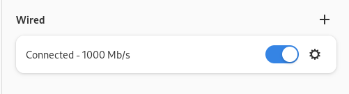

  <h1>Tugas 2</h1>
  <h2>Workshop Administrasi Jaringan</h2>
  <strong>DEBIAN</strong>

  

    
  
Oleh:

<li>Denti Widayati (3122500003)</li>
<li>Virginia Faiqoh (3122500022 )</li>
<li>Adira Callysta (3122500025 )</li>

 

  Dosen Pembimbing     :  Dr. Ferry Astika Saputra ST, M.Sc

 
PROGRAM STUDI D3 TEKNIK INFORMATIKA
POLITEKNIK ELEKTRONIKA NEGERI 
SURABAYA
2023 / 2024

      

  
1. Ubahlah alamat IP dinamis menjadi statis

  
<mark>Jawaban : </mark>

  
 Ada dua cara untuk melakukan setting network di debian yaitu melalui GUI (Network Manager) dan CLI (Menggunakan file /etc/network/interfaces)

  Default gateway :

    

  <h3> A. Menggunakan Network Manager </h3>

  <td> <ol type="1">
  
  <li>Buka Network Manager dengan meng klik ikon setting di pojok kanan atas  

     

  <li> Setelah itu akan masuk ke halaman setting  

     

  <li> Pilih Interfaces yang sudah tersambung, lalu klik ikon setting pada interface tersebut 

     

  <li> Pilih menu IPV4 lalu klik manual. Kemudian, masukkan konfigurasi  - alamat IP
  Address : 10.0.2.100  
  - Netmask : 255.255.255.0  
  - DNS : 8.8.8.8  
  Lalu Klik Apply 

     

  </td>

  <h3> B. Menggunakan Network Manager </h3>

  <td> <ol type="1">
  
  <li>Buka terminal, lalu ketikkan /etc/network/interfaces  

     

  <li>Isi file dibagian paling bawah sesuai dengan konfigurasi yang diinginkan. Setelah itu klik simpan dan keluar 

     

  <li>Ketikkan perintah sudo ifdown(nama interfaces) untuk mematikan interface  

     

  <li>Ketikkan perintah sudo ifup(nama interfaces) untuk mengaktifkan kembali interface dengan pengaturan yang baru  

     

  <li>Kemudian cek menggunakan perintah ~$ ip address  

     

  <li>Lakukan pengujian. disini pengujian dilakukan dengan meng ping google  

     

  </td>

Setelah melakukan salah satu cara di atas, pengaturan network di debian akan berubah sesuai dengan yang kita inginkan.