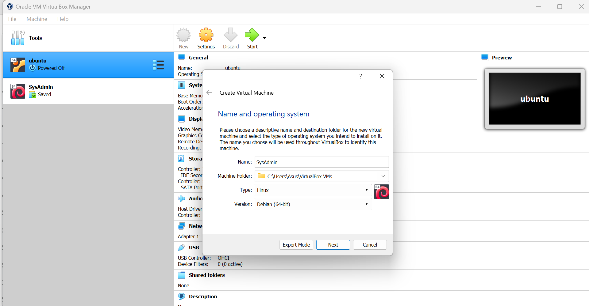

  <h1>Tugas 1 </h1>
 <h2>  Workshop Administrasi Jaringan</h2>
<strong>DEBIAN</strong>

  

Oleh:

<li>Denti Widayati (3122500003)</li>
<li>Virginia Faiqoh (3122500022 )</li>
<li>Adira Callysta (3122500025 )</li>

 

  Dosen Pembimbing     :  Dr. Ferry Astika Saputra ST, M.Sc

 
PROGRAM STUDI D3 TEKNIK INFORMATIKA
POLITEKNIK ELEKTRONIKA NEGERI 
SURABAYA
2023 / 2024

      

  
1. Buatlah tulisan tentang langkah-langkah instalasi sistem operasi Debian. Anda bisa menggunakan aplikasi virtualisasi seperti VirtualBox, VMWare Player, Vmware Fusion (MAC), dls. Kebutuhan sistem adalah sebagai berikut :
CPU : 2 core
RAM : 4096 (min)
HDD : 25 GB dengan partisi :
/ : 20 GB
/storage : 5 GB
swap : 1,5 GB
Hostname : SysAdmin-NRP

jawab : 

1. Langkah pertama Downloading Debian Versi 12 (yang terbaru )

<li>Pilih file ISO yang sesuai dengan arsitektur komputer Anda (32-bit atau 64-bit).</li>
<li>Simpan file ISO di lokasi yang mudah diakses.</li>
 

  

2. Download VirtualBox atau aplikasi Virtualisasi lainnya  https://www.virtualbox.org/wiki/Downloads.
setelah terinstall Pasang VirtualBox ke PC 
<li>Pastikan mengunduh versi VirtualBox yang sesuai dengan sistem operasi Anda (Windows, macOS, Linux, dll.).</li>
<li>Jalankan file installer VirtualBox dan ikuti petunjuk di layar untuk menyelesaikan proses instalasi.</li>
 

3. Masuk ke VirtualBox seperti pada gambar, pilih menu New atau Baru
<li>Jendela "Buat Mesin Virtual Baru" akan muncul.</li>

  

4. berikan nama file SysAdmin( sebagai contoh) 
Rubah bagian Version ke Debian (64-bit),Pilih Linux lalu next sebagai sistem operasi

  

5. Atur jumlah memori RAM yang akan dialokasikan ke mesin virtual di rekomendasikan Minimal  4096 MB 
<li>Jumlah RAM yang Anda alokasikan akan memengaruhi kinerja mesin virtual.
<li>Buat hard disk virtual baru. Pilih Buat hard disk virtual baru sekarang.</li>
<li>Hard disk virtual adalah tempat penyimpanan sistem operasi dan data Debian.</li>
<li>Pilih jenis file hard disk virtual. Direkomendasikan VDI (VirtualBox Disk Image).</li>
<li>VDI adalah format file hard disk virtual yang paling umum </li>

  

6. Atur ukuran hard disk virtual. Direkomendasikan minimal 20 GB.
<li>Ukuran hard disk virtual harus cukup besar untuk menampung sistem operasi dan data Anda.</li>

  

7. Klik Buat.
<ol type="A">
    <li>VirtualBox akan membuat mesin virtual baru dengan nama dan pengaturan yang Anda pilih. Pilih mesin virtual "Debian 12" dan klik Mulai. Masukkan file Debian yang sudah diunduh sebelumnya seperti pada gambar.</li>
</ol>
<ol type="a">
    <li>Mesin virtual akan dimulai dan Anda akan melihat jendela boot.</li>
</ol>

  

8. Tekan Enter untuk boot dari file ISO Debian 12.
Proses instalasi Debian akan dimulai.
 

9. Pilih partisi disk. Direkomendasikan untuk menggunakan seluruh hard disk virtual.
<li>Anda dapat memilih untuk mempartisi hard disk virtual secara manual atau menggunakan partisi default.</li>
<li>Konfirmasi pengaturan partisi.
Pastikan Anda puas dengan pengaturan partisi sebelum melanjutkan.</li>

  

10. <strong>Instal paket perangkat lunak dasar.</strong>
<li>Debian menawarkan berbagai paket perangkat lunak yang dapat Anda pilih selama instalasi.</li>
<strong> Instal bootloader.</strong>
<li>Bootloader adalah program yang memuat sistem operasi saat komputer dinyalakan.</li>

  

11. Pilih bahasa yang akan digunakan selama instalasi.
<li>Anda dapat memilih bahasa Indonesia dari daftar bahasa yang tersedia.

  

12. Atur bahasa pada keyborad dan tataletak Keyboard

  

13. Tunggulah Hingga install, configure selesai 

  

14. Masukkan nama pengguna dan password 

  

15. Selesaikan finish installation dan pilih bahasa yang di gunakan, dan Next Debian 12 telah terinstall dan bisa di gunakan 

  

  
2. Buat ringkasan tentang perbedaan dari Debian 12 (bookworm) dengan Debian 11 (bullseye) : versi kernel, kebutuhan sistem, penerapan systemd dan perbedaan packagenya (dalam bentuk tabel) !

  
<mark>Jawab : </mark>

  <table border="1">
  <tr>
    <th>Perbedaan</th>
    <th>Debian 12 (bookworm)</th>
    <th>Debian 11 (bullseye)</th>
  </tr>
  <tr>
    <td>Versi Kernel</td>
    <td>5.15 atau yang lebih baru</td>
    <td>5.10 atau yang lebih lama</td>
  </tr>
  <tr>
    <td>Penerapan systemd</td>
    <td>Penerapan systemd</td>
    <td>Mungkin menggunakan versi systemd yang lebih tua dengan fitur yang lebih sedikit atau perubahan yang lebih konservatif.</td>
  </tr>
  <tr>
    <td>Perbedaan Paket</td>
    <td> <ol type="1">
      <li> Paket-paket terbaru dengan pembaruan dan peningkatan fitur.
      <li> Bisa mencakup versi perangkat lunak yang lebih baru dengan fitur yang diperbarui dan perbaikan keamanan. 
     <li> Pembaruan mungkin termasuk aplikasi, pustaka, dan perangkat lunak sistem.
    </td>
    <td> <ol type="1">
      <li> Mungkin memiliki paket-paket yang lebih stabil dan sudah diuji secara luas.
      <li> Beberapa paket mungkin tidak sebaru versi di Debian 12 karena fokus pada stabilitas. 
     <li>  Paket dapat mencakup berbagai jenis perangkat lunak seperti aplikasi desktop, server, dan utilitas sistem.
    </td>
  </tr>
  </table>

    

  
3. Jelaskan fungsi dari file "/etc/groups" beserta formatnya!

  
<mark>Jawab : </mark>

  
File "/etc/group" adalah file konfigurasi pada sistem operasi Unix dan Linux yang menyimpan informasi tentang grup pengguna. Fungsi utamanya adalah untuk mengatur hak akses dan izin grup pada sistem. Setiap baris dalam file "/etc/group" mengandung informasi tentang satu grup, termasuk nama grup, ID grup, daftar anggota, dan grup primer (jika ada)

  <td> <ol type="1">
      <li> Nama Grup (nama_grup): Ini adalah nama yang diberikan untuk grup. Nama grup biasanya dipilih untuk mencerminkan fungsi atau tujuan dari grup tersebut. Misalnya, grup dengan nama "wheel" mungkin digunakan untuk memberikan hak akses administratif atau "developers" untuk pengembang perangkat lunak.
      <li> Password (password): Kolom ini sebenarnya bukan kata sandi, tetapi merupakan tempat di mana kata sandi grup disimpan (biasanya terenkripsi). Namun, penggunaan kata sandi grup dalam file "/etc/group" saat ini kurang umum. Jika digunakan, kolom ini biasanya berisi karakter yang menandakan adanya kata sandi terenkripsi, seperti "x". Sebagai catatan, kata sandi grup yang disimpan di sini tidak dipakai lagi karena alasan keamanan, dan kebijakan modern menyimpannya di file /etc/gshadow. 
     <li> ID Grup (ID_grup): Ini adalah identifikasi numerik unik untuk grup. ID grup digunakan oleh sistem operasi untuk mengidentifikasi dan mengelola grup. Setiap grup harus memiliki ID grup yang berbeda, dan ID tersebut biasanya adalah bilangan bulat positif.
     <li> Daftar Anggota (daftar_anggota): Ini adalah daftar pengguna yang menjadi anggota grup tersebut. Anggota-anggota ini biasanya dipisahkan oleh koma. Anggota grup memiliki hak akses yang sama terhadap sumber daya yang terkait dengan grup, seperti berkas atau direktori yang memiliki izin grup yang sesuai.
    </td>
    
  
File "/etc/group" digunakan oleh sistem operasi untuk mengatur dan mengelola izin akses grup. Misalnya, ketika sebuah berkas atau direktori dibuat, pemilik dan grup default diberikan berdasarkan konfigurasi di sini. Izin grup juga dapat diberikan kepada berkas atau direktori untuk mengizinkan anggota grup tertentu untuk mengaksesnya.
 
  
Penting untuk diingat bahwa file "/etc/group" umumnya hanya dapat diakses oleh pengguna dengan hak akses administratif (seperti root) untuk mencegah manipulasi yang tidak sah atau perubahan yang tidak diinginkan terhadap konfigurasi grup pengguna.

    

  
4. Jelaskan perbedaan penggunaan perintah "su" dengan "su -"!

  
<mark>Jawab : </mark>

  <td> <ol type="a">
    <li>
su : 

    
    
Ini berarti  berpindah ke pengguna root, juga dikenal sebagai administrator super, pengguna tingkat tertinggi dan pengguna terluas di Linux. Harus memasukkan kata sandi untuk pengguna root di sini. Jika berhasil, beralih ke pengguna root yang ditandai dengan nomor prompt #.
  

  <li>
su- : 

  
  
Menjadikan shell sebagai shell login dengan lingkungan yang sangat mirip dengan login asli, dan mengubah direktori kerja saat ini. Jalankan skrip login untuk mengganti nama pengguna tertentu. Harus memasukkan kata sandi untuk pengguna ini.

  </td>

    

  
5. Jelaskan fungsi dari "sudo" !

  
<mark>Jawab : </mark>

  
  
Perintah sudo memungkinkan menjalankan program sebagai pengguna lain (root secara default). Menggunakan akun sudo daripada root lebih aman karena memungkinkan memberikan hak administratif terbatas kepada pengguna individu tanpa mengetahui kata sandi root. berikut adalah beberapa opsi perintah sudo

  

    

  
6. Jelaskan langkah-langkah penambahan user anda sebagai user sudo ! Gunakan perintah "su -" lalu setelah masuk sebagai root, jalankan perintah "visudo". Tambahkan user anda di bawah user root pada bagian " # User privilege specification"

  
<mark>Jawab : </mark>

  <td> <ol type="a">
  <li>Ketikkan perintah su - untuk masuk ke root dan ketikkan password lalu tekan enter  
  

  <li>Ketikkan perintah visudo  
  

  <li>Pada bagian "# User privilege specification", tambahkan baris untuk menambahkan pengguna sebagai pengguna sudo.  
  

  <li>Tekan Ctrl + X, lalu ketik Y untuk menyimpan perubahan, dan tekan Enter.

   </td>

  

